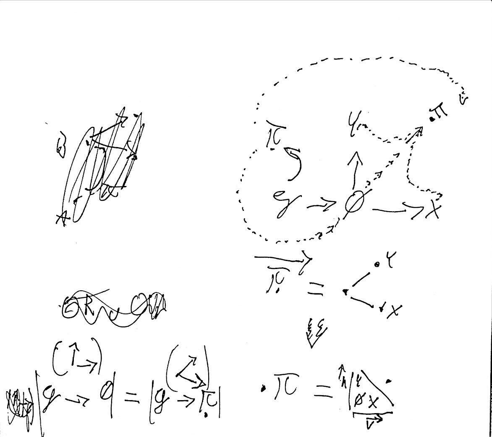

# Transcendental operator

Transcendence operator is such operator, which returns a tuple containing objects of same order, for any algebraic structure with elements, that have taxonomic properties <==> elements belong to two or more disjoint sets, where every set for all their elements satisfies a predefined inequality relation, dependent on the generative context. Specific inequality relation, is given, by binary inequality relation, between the edges starting from the common point(point of categorical divergence).

### Example

Let's for take this diagram for example.

In this case, if we specify the inequality relation by the rule  $$\vec{h} > \vec{v}$$, then $$\forall{x,y} \in X, Y | y > x$$ &#x20;

For example in context of standard algebras, Y and X can accordingly represent: **Operators** and **numbers(values)**. Every operator is higher order object, than any number.

Think about it as kinda teleporter/transformator, which for particular generative elements, gives you flattened structure containing, all generated objects grouped into well-typed comparable(hierarchical) categories. &#x20;
