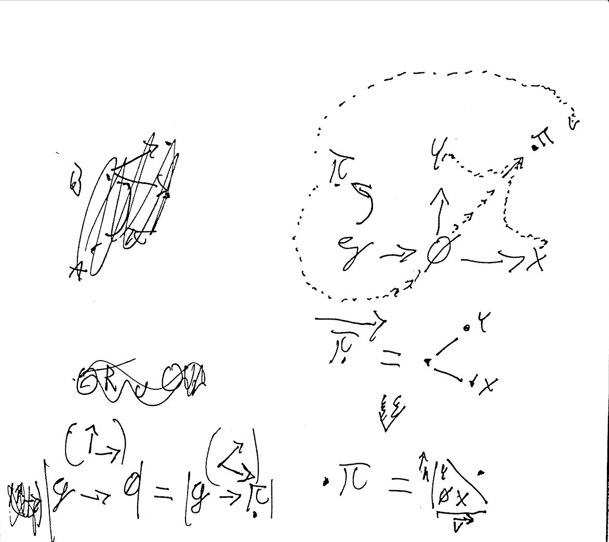

# Trascendence operator

Transcendence operator is such operator, which returns a tuple containing objects of same order, for any algebraic structure with elements, with taxonomic properties <==> disjoint sets with such elements that for sets X and Y. all(Y) > X. For example in standard algebras, those are operators and numbers. Every algebraic expression can be said to be a form of `[x][fx]+`

